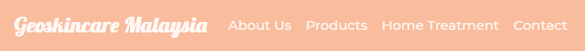
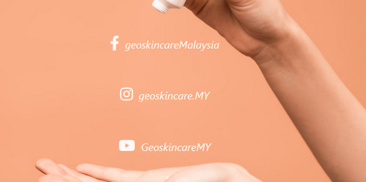
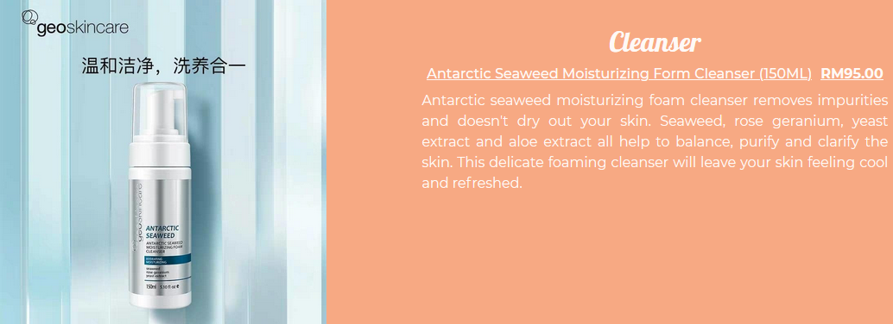

# Geoskincare Malaysia

This is a website for skincare lovers that seek products with natural ingredients, no fragrance and animal cruelty free.
It also provides home treatment for customers that are too busy to visit a beauty clinic.

Enter the Website [here](https://tanyapond.github.io/Geoskincare-Malaysia/).

- ## User Stories

   - ### First Time Visitor Goals

      1. As a First Time Visitor, I want to easily grasp the purpose of the site and learn more about the products and treatment care.
      2. As a First Time Visitor, I want to look around the site easily.
      3. As a First Time Visitor, I want to know if the company is trustworthy through their social media and testimonials.
      4. As a First Time Visitor, I want to check the information of products and cost to know if it's affordable and suitable for my skin.
      5. As a First Time Visitor, I want to get into contact with them.

   - ### Returning Visitor Goals

      1. As a Returning Visitor, I want to find out if there are any promotions/ offers.
      2. As a Returning Visitor, I want to be able to give them feedback.   

   - ### Frequent User Goals

       1. As a Frequent User, I want to check if there are any new monthly promotions/offers.
       2. As a Frequent User, I want to check if there are any new skincare products.

   - ### Site Owner Goals 
       
       1. As a Site Owner, I want the promotion to attract First Time Visitor and Return Customer.
       2. As a Site Owner, I want First Time Visitor to have interest in the brand because of the information in this site.
       3. As a Site Owner, I want Frequent User to know right away what is the promotion for this month.
       4. As a Site Owner, I want to gain more customers from this site.

- ## Design

   - ### Color Theme

      The two main colours used are Light Salmon, Vivid Tangerine and Isabelline.
      The Navbar and Footer colors used are Congo Pink, Peach Crayola and Isabelline.

   - ### Font

      1. Lobster as the Heading Title choices because it's fun and bold.
      2. Montserrat as the normal text because it's clean and simple and it's easily pair with any Heading choice of font.
      3. Sans Serif will be the fall back font if both Lobster and Montserrat fonts don't work.

   - ### Wireframe

      1. 
      2. Tablet is the same as Desktop version.

- ## Features

   - ### Existing Features

      1. Allow user to fill in form so we can get in touch with them.
      2. Responsive on all device sizes.
      3. Carousel in Home Treatment page to show what type of nano-gun and serum is available.
      4. Video in Home Treatment page to show how to use the nano-gun.
      5. Promotion in homepage.
      6. Social link to direct Users to social media page.

   - ### Features Left to Implement
      
      1. Add a shopping cart and checkout section.
      2. Back to top button in Products page.
      3. Newsletter to inform customer of our new products.

- ## Technologies Used

   - ### Languages

      1. [HTML](https://en.wikipedia.org/wiki/HTML)
      2. [CSS](https://en.wikipedia.org/wiki/CSS)
      3. [Javascript](https://en.wikipedia.org/wiki/JavaScript)

   - ### Frameworks, Libraries & Programs Used

      1. [Bootstrap v4.5.2](https://getbootstrap.com/) (Responsiveness and styling of the website.)
      2. [Google Fonts](https://fonts.google.com/) ('Lobster' and 'Montserrat' were used on all pages in this project.)
      3. [Font Awesome v5.14.0](https://fontawesome.com/) (Used on all pages to add icon for aesthetic and UX purposes.)
      4. [GitPod](https://www.gitpod.io/) (Used terminal to git commit and git push to GitHub.)
      5. [GitHub](https://github.com/) (Store projects after being pushed from Gitpod.)
      6. [Balsamiq](https://balsamiq.com/) (Used to design the layout of the website.)
      7. [PicResize](https://picresize.com/) (Used for resizing images that are too large.)
      8. [Coolors](https://coolors.co/) (Used to find a matching color for website theme.)

- ## Testing

     1. Tested HTML code via [W3C Markup Validator](https://validator.w3.org/) and results show no errors.
     2. Tested CSS via [W3C CSS Validator Services](https://jigsaw.w3.org/css-validator/) and results show 1 warnings about imported style sheets are not checked in direct input and file upload modes but it's not affecting the site. 

    - ### Testing User Stories from User Experience (UX) Section

      - #### First Time Visitor Goals 

         ##### As a First Time Visitor, I want to easily grasp the purpose of the site and learn more about the products and treatment care.
          1. When entering the site, Users are greeted with a welcome sign and learn more button on the right. On the left there is a promotion for this month that will attract the user to enter the page.
          
         ##### As a First Time Visitor, I want to look around the site easily.
          1. There's a navigation bar at the top of all pages to allow the User to easily click on the desired page.
          
         ##### As a First Time Visitor, I want to know if the site are trustworthy through their social media and testimonials.              
          1. At the bottom of all pages User can locate social media links in the footer.
          
          2. On contact page there is also our social media link.
          
          3. At the about us page, User will notice the customer reviews section.
          
         ##### As a First Time Visitor, I want to check the information of products and cost to know if it's affordable and suitable for my skin.
          1. The price are right next to the name of the product so Users can know the price of the product while they are reading the details of it which will be just under the product or right next to it.
          
         ##### As a First Time Visitor, I want to get into contact with them.
          1. Users can get in touch with us by filling the form in Contact page or they can message us through our social media.
          

      - #### Returning Visitor Goals

         ##### As a Returning Visitor, I want to find out if there are any promotions/ offers.
          1. Users can find the promotion section when they first enter the site. (See above for website promotion image)
         ##### As a Returning Visitor, I want to be able to give them feedback.   
          1. Users can send us message on the Contact page. (See above for website contact image)

      - #### Frequent User Goals 

         ##### As a Frequent User, I want to check if there are any new monthly promotions/offers.
          1. Users can find the promotion section when they first enter the site. (See above for website promotion image)
         ##### As a Frequent User, I want to check if there are any new skincare products.
          2. For now, Users can check our products via our social media but in the future, we will be adding a newsletter subscription to inform Users about it.

    - ### Further Testing

      1. The Website was tested on Google Chrome and Firefox and there is no errors.
      2. The website was viewed on a variety of devices such as Desktop, Laptop, iPhone 7, 8 & X and there's an issue regarding Home Treatment carousel images being too stretch but I've fixed it.
      3. A large amount of testing was done to ensure all pages and social media were linking correctly.
      4. I have asked family member to test the website where she experienced no errors and easily navigate to other pages. 

- ## Deployment

   - ### The project was deployed to GitHub Pages using the following steps.

      1. Log into GitHub and locate the [GitHub Repository](https://github.com/Tanyapond/Geoskincare-Malaysia)
      2. At the top of the page, locate the "Settings" button beside "Insights" button on the menu.
      3. Scroll to the bottom until you notice the "GitHub Pages" section.
      4. Under the "Source" dropdown button, choose "Master Branch".
      5. Make sure the /roots folder is chosen too then click save and the page will automatically refresh.
      6. Scroll back to the bottom of the page and locate the now published website on the "GitHub Pages" section.

- ## Credits

   - ### Code
      
      1. [Bootstrap](https://getbootstrap.com/) For majority of the page like row and column, carousel, video and navbar.
      2. [Nav center](https://www.codeply.com/go/qhaBrcWp3v) To center the navigation bar on Desktop and Tablet display.

   - ### Media

      1. Home, About Us and Contact page's images are from [pexels](https://https://www.pexels.com/).
      2. Products and images are from [geoskincaremy](https://www.geoskincare.com.my/).
      3. Home Treatment images are from my sister herself and [geoskincaremy](https://www.geoskincare.com.my/). 
      4. Home Treatment video are from [geoskincare Nano Chip Beauty Instrument Instructions](https://www.youtube.com/watch?v=ZaSKwr6KC6c&t=199s&ab_channel=EmilyYin)

   - ### Content
    
      All products and promotion content is from either my sister or from [geoskincaremy](https://www.geoskincare.com.my/) and [geoskincare](https://www.geoskincare.com/)     